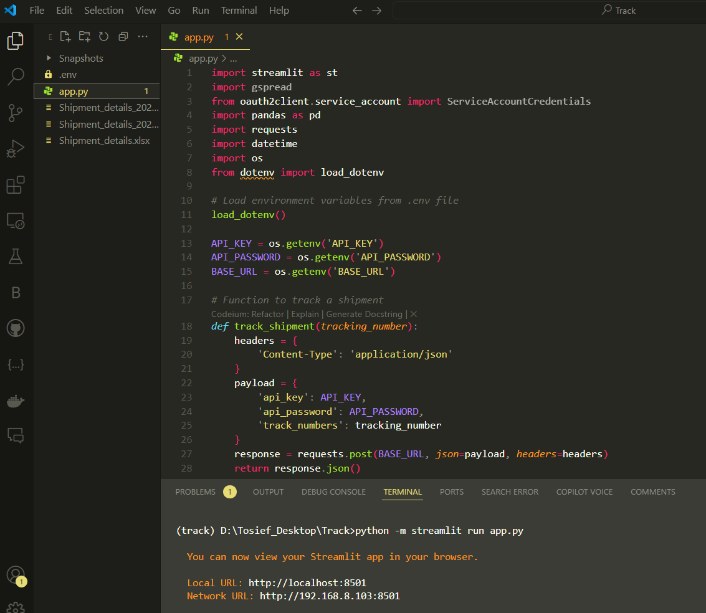
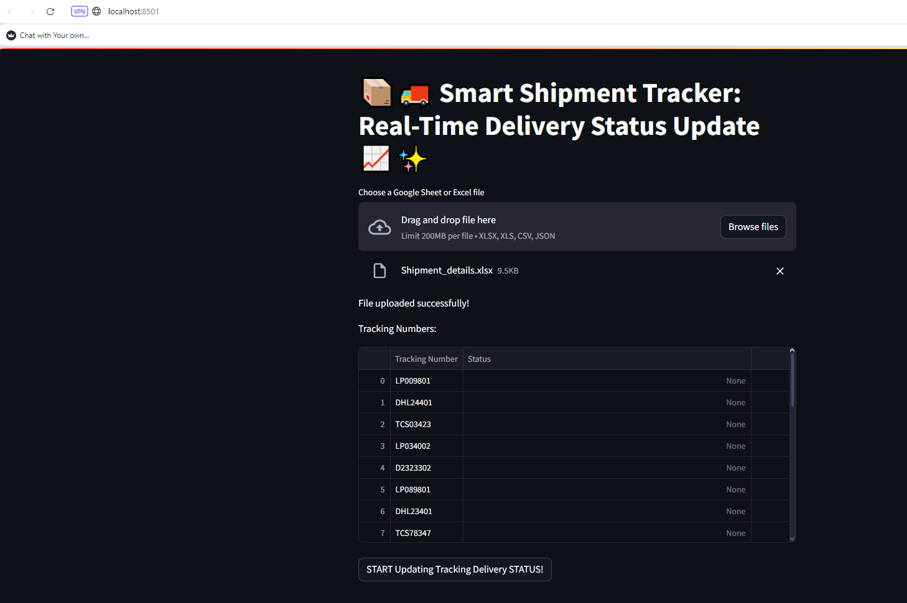
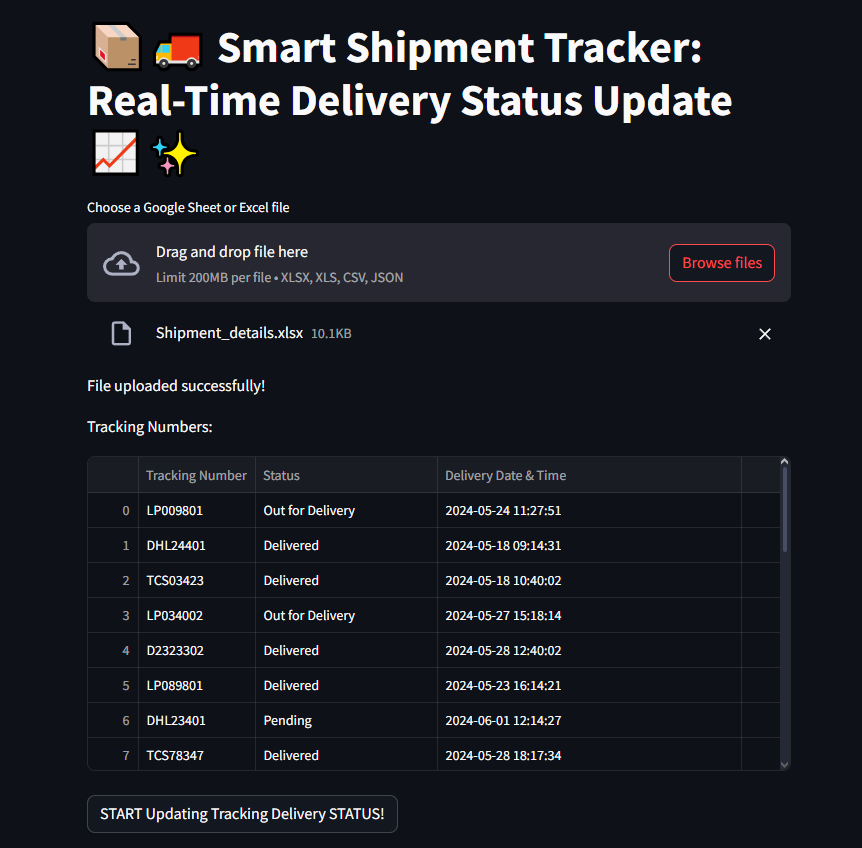

Happy introduce the Smart Shipment Tracker, a sophisticated tool engineered to transform shipment monitoring with real-time updates. Built using Streamlit and Python, this application simplifies the process of tracking deliveries for logistics operations.

📦 Key Features of the Smart Shipment Tracker:

**Automated Shipment Tracking:** Leverages a robust Python backend to automate the retrieval of shipment statuses from external APIs.
Real-Time Delivery Status: Provides instant updates on the delivery status of shipments, ensuring users are always informed.
Bulk Data Handling: Allows users to upload shipment data via Google Sheets, Excel, CSV, or JSON files, making it easy to manage large datasets.
🛠️ Technologies Used:

Streamlit: Creates a dynamic and responsive web application interface.
Python: Utilizes libraries like pandas for data manipulation and requests for HTTP communications.
Gspread & OAuth2: Integrates with Google Sheets to read and update shipment data seamlessly.
This project not only boosts efficiency in tracking but also enhances transparency in delivery processes. It's perfect for businesses looking to streamline their logistics operations with technology.

👀 Explore the screenshots below to see the Smart Shipment Tracker in action and visit the GitHub link for more details or to try it out yourself.

## Snapshot of the application's backend code in an IDE, showing the Python script responsible for shipment tracking

## Initial interface of the Smart Shipment Tracker application on Streamlit, displaying the file upload feature for tracking numbers

## Updated interface showing real-time delivery status updates for various shipments after processing tracking numbers

